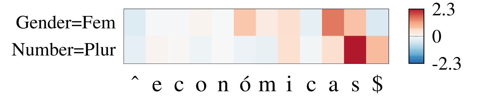

# Introduction
This project contains the necessary files to reproduce the paper:
["Explaining Character-Aware Neural Networks for Word-Level Prediction:
Do They Discover Linguistic Rules?"](https://arxiv.org/abs/1808.09551)

An example is given in the figure below. It shows the individual character contributions of the Spanish adjective económicas. The character
a has the highest positive (red) contribution for predicting the label Gender=Fem, and the character s for
predicting the label Number=Plur. This coincides with our linguistic knowledge of Spanish.




# Framework
All code was implemented in Python 3.5. We used Pytorch 0.4.0.. 

# Data
The Universal Dependencies v1.4 dataset should be downloaded from http://universaldependencies.org/.
In the supplementary material pdf, additional information can be found on the exact preprocessing.

All files of type *-ud-train.conllu, *-ud-dev.conllu and *-ud-test.conllu, should be place in a single data folder DATA_PATH_UD.

All other necessary files are provided in the data-folder of this project.

# Training
Open a shell a move into the 'morpho_tagging' folder.
The following command can be used to train a model on the UD dataset.

```
CUDA_VISIBLE_DEVICES=0 python3 train.py --data_path_ud DATA_PATH_UD --save_dir SAVE_DIR --language LANGUAGE --char_type CONV_OR_BILSTM
```

The most important values to fill in:
- DATA_PATH_UD: the path of the Universal Dependencies Dataset
- SAVE_DIR: where to save the model and metadata
- LANGUAGE: 'fi' for Finnish, 'es' for Spanish or 'sv' for Swedish. Note that models for all UD languages can be trained and decomposed.
- CONV_OR_BILSTM: either train a CNN ('conv') or a BiLSTM ('bilstm') model

A full overview of all the parameters can be obtained using:
```
CUDA_VISIBLE_DEVICES=0 python3 train.py --help
```
# Evaluation
Move into the folder 'contextual_decomposition'.
Run the following command to evaluate the contextual decomposition for CNNs.
```
python3 evaluate_segmentation.py --settings_name tagger_LANGUAGE_settings_DATE --model_folder SAVE_DIR
```

The parameters to provide are:
- settings_name: name of the model you have trained of the format tagger_LANGUAGE_settings_DATE
- model_folder: SAVE_DIR value from during training

The output will be an overview of the correct/incorrect predictions and attributions of the trained model.
This is the same algorithm as used in the paper for evaluation.

# Visualization
For visualization, one can use the CDConv class which can be found in contextual_decomposition/cd_conv.py.

The file 'example.py' contains an example on how to obtain the contribution values.

